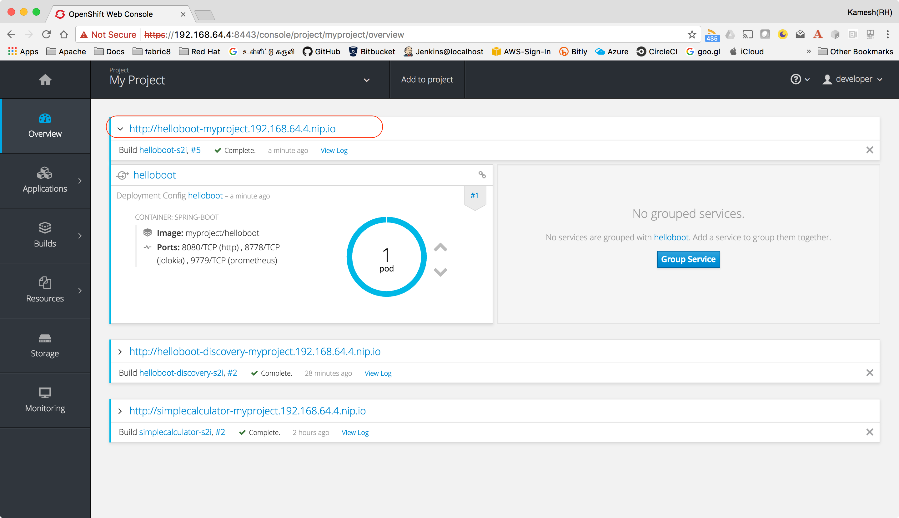

:linkattrs:

= Hello Boot - A simple Spring Boot Microservice

== Install Spring Boot CLI

* Install
https://docs.spring.io/spring-boot/docs/current/reference/html/getting-started-installing-spring-boot.html#getting-started-installing-the-cli[Spring Boot CLI]

* Unzip/Untar it and add spring-1.5.3.RELEASE/bin to your path

== Create Simple Spring Boot project:

[source,sh]
----
spring init --artifactId=helloboot --groupId=com.example --dependencies=web,actuator --extract
----

== Import Project to IDE

Open your IDE and import the project

== Add Simple Hello REST API

[source,java]
----

package com.example.helloboot;

import org.springframework.web.bind.annotation.GetMapping;
import org.springframework.web.bind.annotation.RestController;

/**
 * Simple REST call that says from where its invoked from
 */
@RestController
public class HelloBootController {

    @GetMapping("/whereami")
    public String whereami() {
        return String.format("Hello from %s", System.getenv().getOrDefault("HOSTNAME", "localhost"));
    }
}

----

== Build and run locally

[source,sh]
----
./mvnw clean install spring-boot:run
----

=== Accessing application

The applicaiton can be accessed via browser like http://localhost:8080/whereami["http://localhost:8080/whereami", window="_blank"]

(OR)

Simple curl `curl http://localhost:8080/whereami ; echo ""`

== Deploying in Kubernetes

CRTL + C to stop the running application, if you have minishift running then do `eval $(minishift docker-env)`  to setup required docker environment variables

[source,sh]
----
./mvnw io.fabric8:fabric8-maven-plugin:3.4.1:setup <1>

./mvnw clean fabric8:deploy <2>
----
<1> Setup http://fabric8io.github.io/fabric8-maven-plugin[fabric8 maven plugin]

<2> Build and Deploy the application to Kubernetes

=== Accessing application

[source,sh]
----
curl http://helloboot-myproject.$(minishift ip).nip.io/whereami
----

You can view the URL from OpenShift console, and access the application via browser

-- END --

