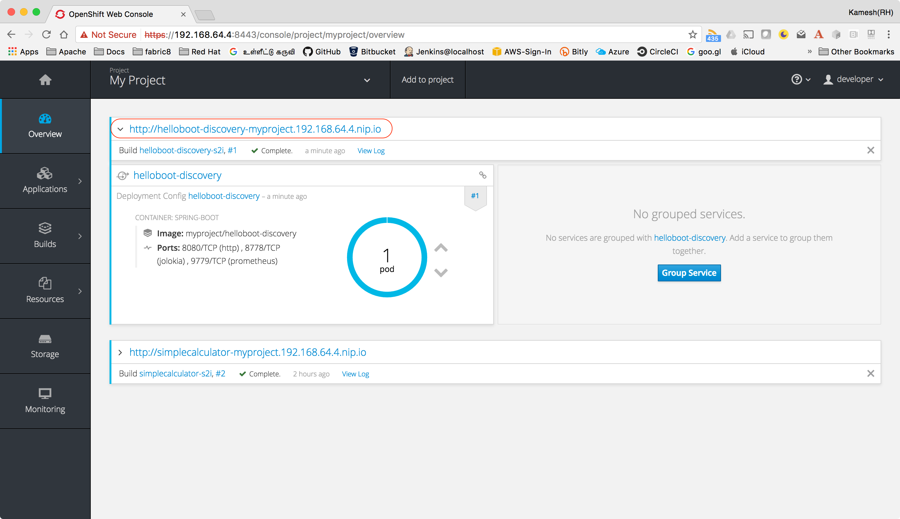
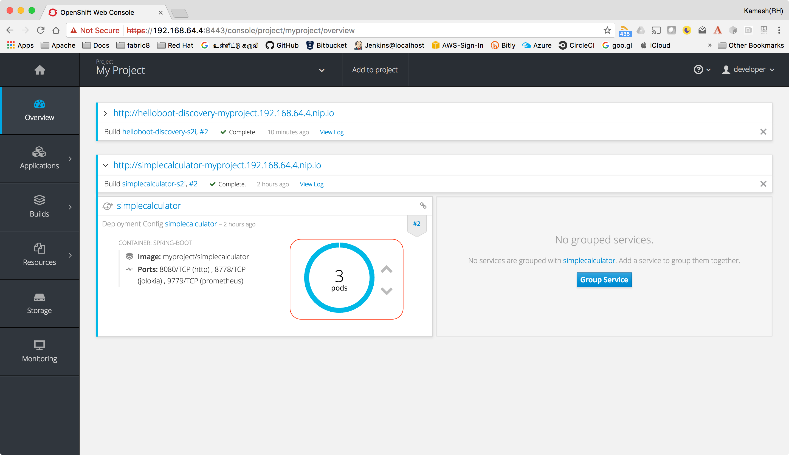

:linkattrs:

= Hello Boot  Discovery

Demo project for Spring Boot which will use Ribbon with Kubernetes Service Discovery

== Install Spring Boot CLI

* Install
https://docs.spring.io/spring-boot/docs/current/reference/html/getting-started-installing-spring-boot.html#getting-started-installing-the-cli[Spring Boot CLI]

* Unzip/Untar it and add spring-1.5.7.RELEASE/bin to your path

== Create Simple Spring Boot project:

[source,sh]
----
spring init --artifactId=helloboot-discovery --groupId=com.example --dependencies=web,actuator,cloud-ribbon --extract helloboot-discovery
----

== Import Project to IDE

Open your IDE and import the project

=== Extra Dependencies

Edit the pom.xml and add the following dependnecies to the project

[source,xml]
----
<dependency>
    <groupId>org.projectlombok</groupId>
    <artifactId>lombok</artifactId>
</dependency>
----

=== Add Spring Cloud Kubernetes Dependency

[source,xml]
----
<dependency>
    <groupId>org.springframework.cloud</groupId>
    <artifactId>spring-cloud-starter-kubernetes-netflix</artifactId>
    <version>0.2.0.RELEASE</version> <1>
</dependency>
----

<1> as of doing this demo "0.2.0.RELEASE" was the latest version

=== Enable Ribbon Client but configurtion application.yml

Rename the existing src/main/resources/application.properties to src/main/resources/application.yml and copy the below content
[source,yaml]
----
spring:
  cloud:
    kubernetes:
      client:
        namespace: myproject <1>
  application:
    name: helloboot <2>

simplecalculator:
  ribbon:
    eureka:
      enabled: false <3>
    client:
      enabled: true <4>
    ServerListRefreshInterval: 5000
----

<1> The Kubernetes namespace where the project will be deployed
<2> The name of the application
<3> Disable Netflix Eureka as we will be using Kubernetes for Service Discovery
<4> Enable Ribbon Client

=== Add Calculator Service

[source,java]
----

package com.example.hellobootdiscovery;

import lombok.extern.slf4j.Slf4j;
import org.springframework.stereotype.Service;
import org.springframework.web.client.RestTemplate;

@Service
@Slf4j
public class CalculatorService {

    private RestTemplate restTemplate;

    public CalculatorService(RestTemplate restTemplate) {
        this.restTemplate = restTemplate;
    }

    public String add(int n1,int n2) {
        String response = restTemplate.getForObject("http://simplecalculator/add/{n1}/{n2}",
                String.class, n1, n2);
        log.info("Response:{}", response);
        return response;
    }
}

----

=== Add Calculator Service Consumer

[source,java]
----

package com.example.hellobootdiscovery;

import lombok.extern.slf4j.Slf4j;
import org.springframework.web.bind.annotation.GetMapping;
import org.springframework.web.bind.annotation.RestController;

import java.util.Random;

@RestController
@Slf4j
public class CalculatorController {
    private final CalculatorService calculatorService;

    public CalculatorController(CalculatorService calculatorService) {
        this.calculatorService = calculatorService;
    }

    @GetMapping("/randomadd")
    public String randomAdd() {
        log.info("Calling Calculator Service: simplecalculator");
        Random random = new Random();
        return calculatorService.add(random.nextInt(),random.nextInt());
    }
}

----

=== Add Ribbon Configuration

[source,java]
----

package com.example.hellobootdiscovery;

import com.netflix.client.config.IClientConfig;
import com.netflix.loadbalancer.AvailabilityFilteringRule;
import com.netflix.loadbalancer.IPing;
import com.netflix.loadbalancer.IRule;
import com.netflix.loadbalancer.PingUrl;
import org.springframework.beans.factory.annotation.Autowired;
import org.springframework.context.annotation.Bean;

public class SimpleCalculatorRibbonConfiguration {

    @Autowired
    IClientConfig ribbonClientConfig;

    /**
     *  PingUrl will ping a URL to check the status of each server.
     *  Say Hello has, as you’ll recall, a method mapped to the /path; that means that Ribbon will get an HTTP 200 response when it pings a running Backend Server
     *
     * @param  config Client configuration
     * @return The URL to be used for the Ping
     */
    @Bean
    public IPing ribbonPing(IClientConfig config) {
        return new PingUrl();
    }

    /**
     * AvailabilityFilteringRule will use Ribbon’s built-in circuit breaker functionality to filter out any servers in an “open-circuit” state:
     * if a ping fails to connect to a given server, or if it gets a read failure for the server, Ribbon will consider that server “dead” until it begins to respond normally.
     *
     * @param  config Client configuration
     * @return The Load Balancer rule
     */
    @Bean
    public IRule ribbonRule(IClientConfig config) {
        return new AvailabilityFilteringRule();
    }
}

----

=== Configure Spring Boot Application to use Ribbon

[source,java]
----

package com.example.hellobootdiscovery;

import org.springframework.boot.SpringApplication;
import org.springframework.boot.autoconfigure.SpringBootApplication;
import org.springframework.cloud.client.discovery.EnableDiscoveryClient;
import org.springframework.cloud.client.loadbalancer.LoadBalanced;
import org.springframework.cloud.netflix.ribbon.RibbonClient;
import org.springframework.context.annotation.Bean;
import org.springframework.context.annotation.Configuration;
import org.springframework.web.client.RestTemplate;

@SpringBootApplication
@EnableDiscoveryClient //<1>
@RibbonClient(name = "simplecalcuator", configuration = SimpleCalculatorRibbonConfiguration.class) //<2>
public class DemoApplication {

  public static void main(String[] args) {
    SpringApplication.run(DemoApplication.class, args);
  }

  @Configuration
  public class MyConfig {

    @Bean
    @LoadBalanced //<3>
    public RestTemplate restTemplate() {
      return new RestTemplate();
    }
  }
}
----
<1> Enabling Spring Cloud Discovery
<2> Configuring Netflix Ribbon Client - to use Kubernetes service link:../simplecalculator[simplecalulator]
<3> Making the REST calls to external "simplecalculator" using Netflix Ribbon Client side load balancing

== Deploying in Kubernetes

CRTL + C to stop the running application, if you have minishift running then do `eval $(minishift docker-env)`  to setup required docker environment variables

[source,sh]
----
./mvnw io.fabric8:fabric8-maven-plugin:3.5.30:setup <1>

----

<1> Setup http://fabric8io.github.io/fabric8-maven-plugin[fabric8 maven plugin]

=== Configure JVM Options

Since Java has some issues using the right amount of memory when running as Docker containers, its better to configure the required Heap size.

Add file called `deployment.yml` with the following contents to src/main/fabric8, allow deployment in Kubernetes add the JVM_OPTIONS when starting the application

[source,yaml]
----
apiVersion: "extensions/v1beta1"
kind: "Deployment"
metadata:
  labels:
    hystrix.enabled: "true"
spec:
  replicas: 1
  template:
    spec:
      containers:
      - env:
        - name: "JAVA_OPTIONS"
          value: "-Xms256m -Xmx256m"
----

[source,sh]
----
./mvnw clean fabric8:deploy <1>
----

<1> Build and Deploy the application to Kubernetes

[NOTE]
====

When deploying application in OpenShift we need to provide the project with view role to discover the services in the local cluster.

Add the following yaml content to `src/main/fabric8/rb.yml`

[source,yaml]
----
roleRef:
  name: view
subjects:
- kind: ServiceAccount
  name: default
----

====

=== Accessing application

[source,sh]
----
curl http://helloboot-discovery-myproject.$(minishift ip).nip.io/randomadd
----

You can view the URL from OpenShift console, and access the application via browser as well

==== Testing Load Balancing

Netflix Ribbon is a client side load balancer, to check if the load balancer is working, we need to increase
the instances of 'simplecalculator',  with Kubernetes all you have to do is run the following command

[source,sh]
----
oc scale deploymentconfig simplecalculator --replicas 3
----

Once successfully scaled you can see the pod count via the OpenShift console as shown below,

Now to test the loadbalancing run the following script,
[source,sh]
----
for i in {1..10}; do curl http://helloboot-discovery-myproject.$(minishift ip).nip.io/randomadd ; echo ""; done;
----

In each call you will see the Calculator is served from different host.

-- END --