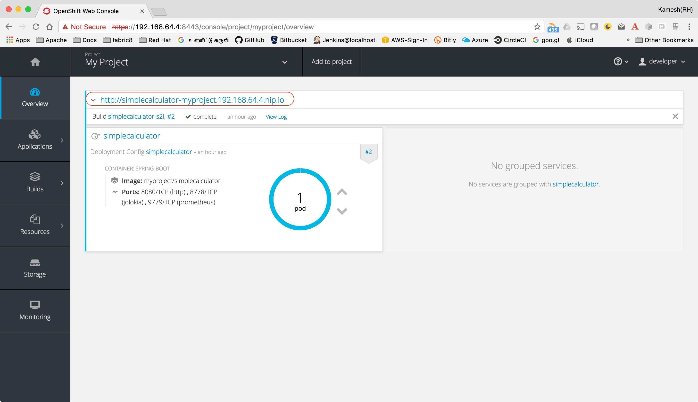

:linkattrs:

= Simple Calculator -

Demo project for Spring Boot which provides a simple calculator service which will
be consumed by link:../helloboot-discovery/README.adoc[helloboot-discovery] application using
https://github.com/spring-cloud-incubator/spring-cloud-kubernetes[Spring Cloud Kubernetes]

== Install Spring Boot CLI

* Install
https://docs.spring.io/spring-boot/docs/current/reference/html/getting-started-installing-spring-boot.html#getting-started-installing-the-cli[Spring Boot CLI]

* Unzip/Untar it and add spring-1.5.3.RELEASE/bin to your path

== Create Simple Spring Boot project:

[source,sh]
----
spring init -d=web,actuator -x simplecalculator
----

== Import Project to IDE

Open your IDE and import the project

=== Extra Dependencies

Edit the pom.xml and add the following dependnecies to the project

[source,xml]
----
<dependency>
    <groupId>org.projectlombok</groupId>
    <artifactId>lombok</artifactId>
</dependency>

<dependency>
    <groupId>org.json</groupId>
    <artifactId>json</artifactId>
</dependency>
----

=== Simple Calculator API

[source,java]
----
package com.example.simplecalculator;

import lombok.extern.slf4j.Slf4j;
import org.json.JSONArray;
import org.json.JSONObject;
import org.springframework.util.StringUtils;
import org.springframework.web.bind.annotation.*;

@RestController
@Slf4j
public class Calculator {

    @CrossOrigin
    @RequestMapping(method = RequestMethod.GET, value = "/add/{num1}/{num2}", produces = "text/plain")
    public String add(@PathVariable("num1") Integer num1, @PathVariable("num2") Integer num2) {
        String hostname = getHostName();
        int result = (num1 + num2);
        log.info("Product Result:{} executed on Pod {}", result, hostname);
        return String.format("Service Host :%s \n %d + %d = %d", hostname, num1, num2, result);
    }

    private String getHostName() {
        return System.getenv().getOrDefault("HOSTNAME", "Unknown");
    }

    @CrossOrigin
    @RequestMapping(method = RequestMethod.GET, value = "/sub/{num1}/{num2}", produces = "text/plain")
    public String sub(@PathVariable("num1") Integer num1, @PathVariable("num2") Integer num2) {
        String hostname = getHostName();
        int result = (num1 - num2);
        log.info("Product Result:{} executed on Pod {}", result, hostname);
        return String.format("Service Host :%s \n %d - %d = %d", hostname, num1, num2, result);
    }

    @CrossOrigin
    @RequestMapping(method = RequestMethod.POST, value = "/mul", produces = "text/plain",
            consumes = "application/json")
    public String mul(@RequestBody String numbersJson) {
        log.debug("Request : {}", numbersJson);
        long product = 1;
        if (numbersJson != null && !StringUtils.isEmpty(numbersJson)) {
            JSONObject jsonObject = new JSONObject(numbersJson);
            JSONArray jsonArray = jsonObject.getJSONArray("numbers");
            if (jsonArray != null && jsonArray.length() > 0) {
                for (int i = 0; i < jsonArray.length(); i++) {
                    product = product * jsonArray.getLong(i);
                }
            }
        }
        String hostname = getHostName();
        log.info("Product Result:{} executed on Pod {}", product, hostname);
        return String.format("Service Host :%s \n Product  = %d", hostname, product);
    }

    @CrossOrigin
    @RequestMapping(method = RequestMethod.POST, value = "/div", produces = "text/plain",
            consumes = "application/json")
    public String div(@RequestBody String numbersJson) {
        log.debug("Request : {}", numbersJson);
        String hostname = getHostName();
        double answer = 0;
        if (numbersJson != null && !StringUtils.isEmpty(numbersJson)) {
            JSONObject jsonObject = new JSONObject(numbersJson);
            JSONArray jsonArray = jsonObject.getJSONArray("numbers");
            if (jsonArray != null && jsonArray.length() > 0) {
                for (int i = 0; i < jsonArray.length(); i++) {
                    double n = jsonArray.getDouble(i);
                    if (n != 0) {
                        if (answer == 0) {
                            answer = n;
                        } else {
                            answer = answer / n;
                        }
                    } else {
                        answer = 0;
                        log.error("Exception Divide by 0");
                        break;
                    }
                }
            }
        }
        log.info("Divide Result:{} executed on Pod {}", answer, hostname);
        return String.format("Service Host :%s \n Answer = %f", hostname, answer);
    }
}

----

== Deploying to Kubernetes

CRTL + C to stop the running application, if you have minishift running then do `eval $(minishift docker-env)`  to setup required docker environment variables

[source,sh]
----
./mvnw io.fabric8:fabric8-maven-plugin:3.4.1:setup <1>

----

<1> Setup http://fabric8io.github.io/fabric8-maven-plugin[fabric8 maven plugin]

=== Configure JVM Options

Since Java has some issues using the right amount of memory when running as Docker containers, its better to configure the required Heap size.

Add file called `deployment.yml` with the following contents to src/main/fabric8, allow deployment in Kubernetes add the JVM_OPTIONS when starting the application

[source,yaml]
----
apiVersion: "extensions/v1beta1"
kind: "Deployment"
metadata:
  labels:
    hystrix.enabled: "true"
spec:
  replicas: 1
  template:
    spec:
      containers:
      - env:
        - name: "JAVA_OPTIONS"
          value: "-Xms256m -Xmx256m"
----

[source,sh]
----
./mvnw clean fabric8:deploy <1>
----

<1> Build and Deploy the application to Kubernetes

=== Accessing application

[source,sh]
----
curl http://simplecalculator-myproject.$(minishift ip).nip.io/add/1/2
----

You can view the URL from OpenShift console, and access the application via browser as well

-- END --