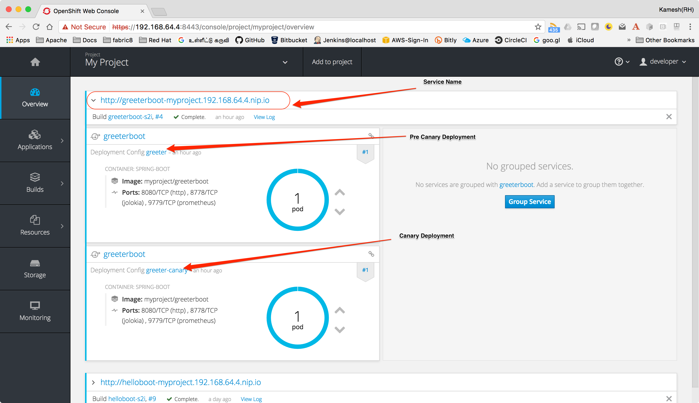

:linkattrs:

= Greeter

How to do https://martinfowler.com/bliki/CanaryRelease.html[Canary Releases] with Spring Boot on Kubernetes

== Install Spring Boot CLI

* Install
https://docs.spring.io/spring-boot/docs/current/reference/html/getting-started-installing-spring-boot.html#getting-started-installing-the-cli[Spring Boot CLI]

* Unzip/Untar it and add spring-1.5.3.RELEASE/bin to your path

== Create Simple Spring Boot project:

[source,sh]
----
spring init --artifactId=greeterboot --name="Greeter Boot:: Canary Demo" --groupId=com.example --dependencies=web,actuator --extract "greeter"
----

== Import Project to IDE

Open your IDE and import the project

== Configure Final name

Add final name to the project.

[source,xml]
----
<finalName>greeter</finalName> <1>
----

<1> the finalName of the artifact that will be used with deployment name in kubernetes

== Add Simple Hello REST API

[source,java]
----

package com.example.greeterboot;

import org.springframework.web.bind.annotation.GetMapping;
import org.springframework.web.bind.annotation.RestController;

/**
 * Simple REST call that says from where its invoked from
 */
@RestController
public class HelloBootController {

    @GetMapping("/hello")
    public String hello() {
        return String.format("Hello from %s", System.getenv().getOrDefault("HOSTNAME", "localhost"));
    }
}

----

== Deploying in Kubernetes

CRTL + C to stop the running application, if you have minishift running then do `eval $(minishift docker-env)`  to setup required docker environment variables

[source,sh]
----
./mvnw io.fabric8:fabric8-maven-plugin:3.4.1:setup <1>

----

<1> Setup http://fabric8io.github.io/fabric8-maven-plugin[fabric8 maven plugin]

=== Deployment properties

Add the following deployment properties to maven

[source,xml]
----
<fabric8.enricher.fmp-controller.name>${project.build.finalName}</fabric8.enricher.fmp-controller.name> <1>
----
<1> the deployment name in Kuberentes

=== Configure JVM Options

Since Java has some issues using the right amount of memory when running as Docker containers, its better to configure the required Heap size.

Update the fabric8-maven-plugin block to look like,

[source,xml]
----
<plugin>
  <groupId>io.fabric8</groupId>
  <artifactId>fabric8-maven-plugin</artifactId>
  <version>3.4.1</version>
  <executions>
      <execution>
          <id>fmp</id>
          <goals>
              <goal>resource</goal>
              <goal>helm</goal>
              <goal>build</goal>
          </goals>
      </execution>
  </executions>
  <configuration>
      <resources>
          <env>
              <JAVA_OPTIONS>-Xms256m -Xmx256m</JAVA_OPTIONS> <1>
          </env>
      </resources>
  </configuration>
</plugin>
----

<1> The java options that will be passed to the java process when starting the application

=== Pre-Canary Deployment

[source,sh]
----
./mvnw clean fabric8:deploy <1>
----

<1> Build and Deploy the application to Kubernetes

==== Accessing the application
[source,sh]
----
curl http://greeterboot-myproject.$(minishift ip).nip.io/hello ; echo "";
----

=== Canary Deployment

==== Add new Maven profile  to deploy canary application

[source,xml]
----
<profiles>
  <profile>
      <id>canary</id>
      <properties>
          <fabric8.generator.name>%a:%v.Canary</fabric8.generator.name> <1>
          <fabric8.enricher.fmp-controller.name>${project.build.finalName}-canary
          </fabric8.enricher.fmp-controller.name> <2>
      </properties>
  </profile>
</profiles>
----
<1> The image tag to use when deploying canary, this should be different from pre-canary
<2> The kubernetes deployment name, this should be again different from pre-canary

==== Modify Simple Hello REST API

[source,java]
----

package com.example.helloboot;

import org.springframework.web.bind.annotation.GetMapping;
import org.springframework.web.bind.annotation.RestController;

/**
 * Simple REST call that says from where its invoked from
 */
@RestController
public class HelloBootController {

    @GetMapping("/hello")
    public String hello() {
        return String.format("Canary Hello from %s", System.getenv().getOrDefault("HOSTNAME", "localhost"));
    }
}

----

[source,sh]
----
./mvnw clean -Pcanary fabric8:deploy <1>
----

<1> Deploy the application using canary maven profile

=== Accessing application

[source,sh]
----
for i in {1..10}; do curl http://greeterboot-myproject.$(minishift ip).nip.io/hello ; echo ""; done;
----

You can view the Service URL, Canary and Pre-Canary Deployment from OpenShift console, and access the application via browser

-- END --
