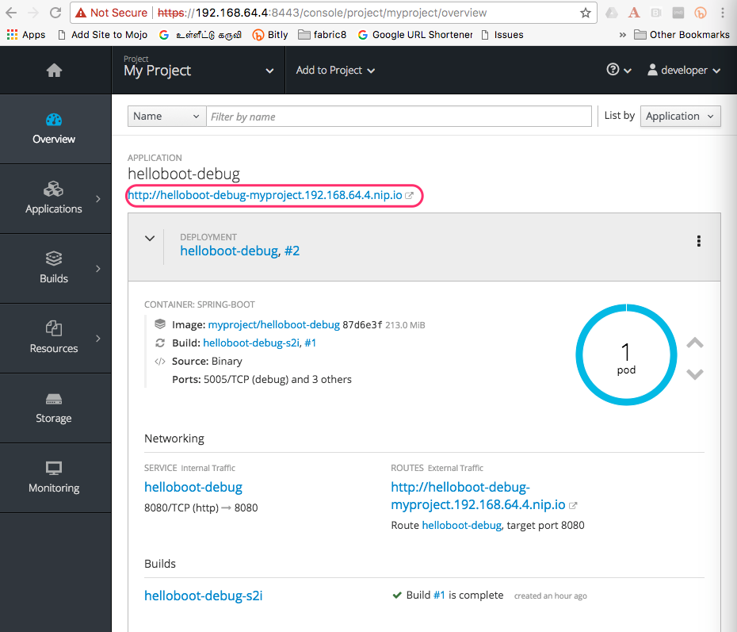

:linkattrs:

= Hello Boot - A simple Spring Boot Microservice

== Install Spring Boot CLI

* Install
https://docs.spring.io/spring-boot/docs/current/reference/html/getting-started-installing-spring-boot.html#getting-started-installing-the-cli[Spring Boot CLI]

* Unzip/Untar it and add spring-1.5.7.RELEASE/bin to your path

== Create Simple Spring Boot project:

[source,sh]
----
spring init --artifactId=helloboot --groupId=com.example --dependencies=web,actuator --extract
----

== Import Project to IDE

Open your IDE and import the project

== Add property to application.properties

[source]
----
message.prefix=Hello! <1>
----
<1> a simple prefix to the messages, we can then use this property for debug

== Add Simple Hello REST API

[source,java]
----

package com.example.helloboot;

import org.springframework.web.bind.annotation.GetMapping;
import org.springframework.web.bind.annotation.RestController;

/**
 * Simple REST call that says from where its invoked from
 */
@RestController
public class HelloBootController {

    @GetMapping("/whereami")
    public String whereami(@Value("${message.prefix}") String prefix) { <1>
        return String.format("% from %s", prefix, System.getenv().getOrDefault("HOSTNAME", "localhost"));
    }
}

----
<1> Inject `prefix` property from `application.properties`

== Build and run locally

[source,sh]
----
./mvnw clean install spring-boot:run
----

=== Accessing application

The applicaiton can be accessed via browser like http://localhost:8080/whereami["http://localhost:8080/whereami", window="_blank"]

(OR)

Simple curl `curl http://localhost:8080/whereami ; echo ""`

== Setup fabric8 maven plugin

CRTL + C to stop the running application, if you have minishift running then do `eval $(minishift docker-env)`  to setup required docker environment variables

[source,sh]
----
./mvnw io.fabric8:fabric8-maven-plugin:3.5.30:setup <1>
----

<1> Setup http://fabric8io.github.io/fabric8-maven-plugin[fabric8 maven plugin]

[NOTE]
=====
As the application is configured to use fabric8-maven-plugin, we can create Kubernetes/OpenShift deployment and service as
fragments in **$PROJECT_HOME/src/main/fabric8**. The fabric8-maven-plugin takes care of building the complete Kubernetes/OpenShift
manifests by merging the contents of the fragment(s) from $PROJECT_HOME/src/main/fabric8 during deploy.
=====

[[app-deploy]]
== Deploying

CRTL + C to stop the running application, if you have minishift running then do `eval $(minishift docker-env)`  to setup required docker environment variables

[source,sh]
----
./mvnw clean fabric8:deploy <1>
----
<1> Build and Deploy the application to Kubernetes/OpenShift

[[access-deploy]]
=== Accessing application

[source,sh]
----
curl http://helloboot-debug-myproject.$(minishift ip).nip.io/whereami
----

You can view the URL from OpenShift console, and access the application via browser

=== Debugging Application

When we <<app-deploy,Deployed>> the application, the application will not be enabled for debug by default, to enable debug
we need to add an env variable `JAVA_DEBUG_ENABLE` to the deployment.

==== Add deployment.yaml

Copy and paste the following content to a file called `deployment.yaml` in **$PROJECT_HOME/src/main/fabric8**

[[source,yaml]
----
spec:
  template:
    containers:
      spec:
        - env:
          - name: JAVA_ENABLE_DEBUG <1>
            value: true

----
<1> Sets the Environment variable to enable debugging

==== Connecting and Debugging

<<app-deploy,ReDeploy>> the application with `JAVA_ENABLE_DEBUG` enabled, once the application is deployed
successfully, run the following command

[source,sh]
----
./mvw fabric8:debug <1>
----

<1> This will do https://kubernetes.io/docs/tasks/access-application-cluster/port-forward-access-application-cluster/[port-forward]
the debug port from your Kubernetes/OpenShift pod to localhost. The default port of the debugger is `5005`.  The default debug port can be overridden usign the Java system property `fabric8.debug.port`

(e.g.)

[source,sh]
----
./mvw fabric8:debug -Dfabric8.debug.port=6005
----

Now you can connect to the Debugger with your favorite IDE

-- END --

